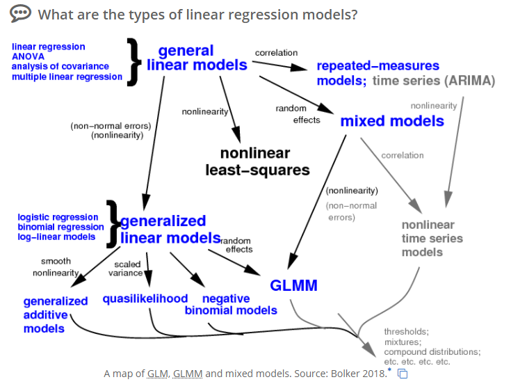
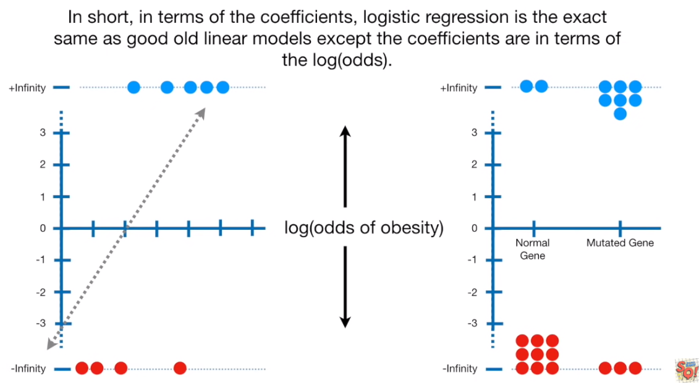
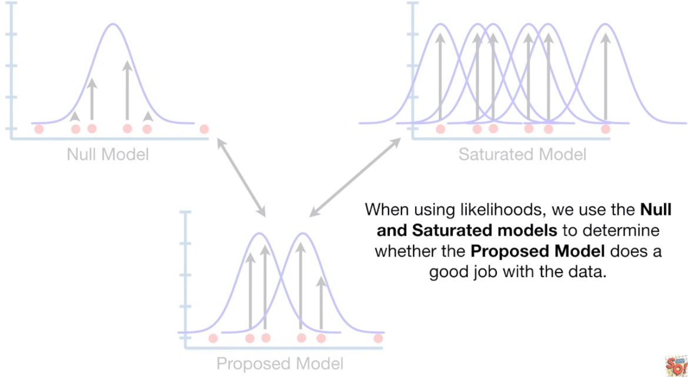
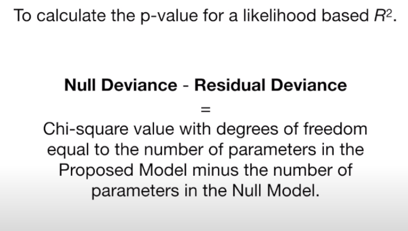
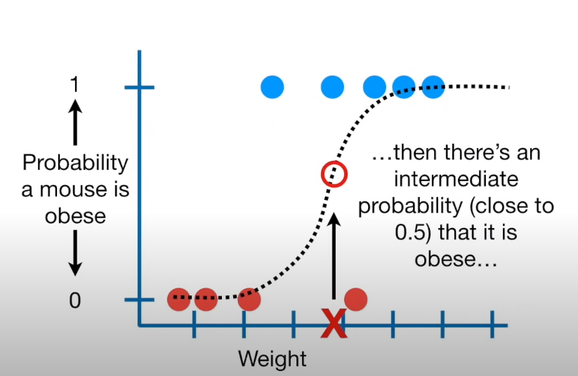
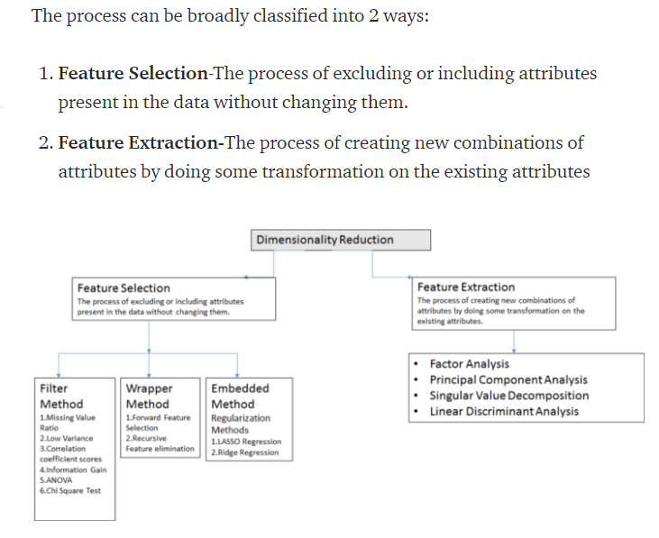
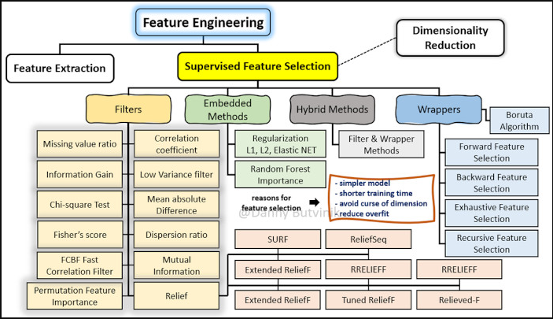
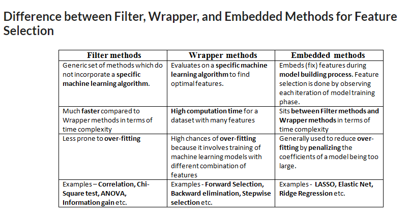
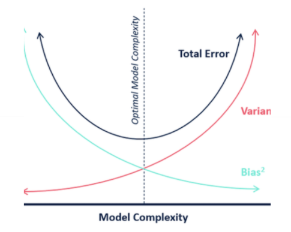
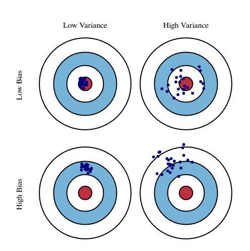

```{r setup, include=FALSE}
knitr::opts_chunk$set(echo = TRUE)
library(faraway) # datasets from author of Linear Models w/ R book
# to make dataset from faraway library workable
statedata <- data.frame(state.x77,row.names=state.abb)

library(leaps) # performs exhaustive search for best regression subset selection
library(pls) # for pcr function in PCA section
library(Metrics) # for rmse function PCA section


```


# 1. Consider data type and goals

Focus on the main objective of the modelling. A larger model might provide better predictions, and we might not want to compromise accurate predictions in favor of a smaller model. If it's more important that the model is easy to interpret and explain you might lean toward a smaller model, and be cautious using automated variable selection procedures.


# 2. Model Options

**Linear models** are the most basic but incredibly useful. However, necessary transformations to make the data more normal can be hard to interpret or can't be applied to negative or zero values.  

**Generalized linear models** have 1) exponential family model for the response, 2) a systematic component via a linear predictor, and 3) a link function that connects the means of the response to the linear predictor.  
Chart (likely not exhaustive) of regression types:




Both ridge regression and lasso regression are addressed to deal with multicollinearity. Ridge regression is computationally more efficient over lasso regression.Any of them can perform better. So the best approach is to select that regression model which fits the test set data well.

## Types {.tabset}

### Linear Regression

Used when response variable is quantitative and continuous. When you have only 1 iindependent variable it's called a *simple linear regression*, with more than 1 independent variable it is *multiple linear regression*.

Despite its simplicity, the linear model has advantages in interpretability and it often shows good predictive performance.  

#### Assumptions of linear regression:
1. There must be a linear relation between independent and dependent variables.
2. There should not be any outliers present.
3. No heteroscedasticity
4. Sample observations should be independent.
5. Error terms should be normally distributed with mean 0 and constant variance.
6. Absence of multicollinearity and auto-correlation.

### Classification


See group HW2 from 621 class.


### Note: regularization concept

Regularization helps to solve over fitting problem which implies model performing well on training data but performing poorly on validation (test) data. Regularization solves this problem by adding a penalty term to the objective function and control the model complexity using that penalty term.

Regularization is generally useful in the following situations:

1. Large number of variables
2. Low ratio of number observations to number of variables
3. High Multi-Collinearity

In L1 regularization we try to minimize the objective function by adding a penalty term to the sum of the absolute values of coefficients. This is also known as least absolute deviations method. Lasso Regression makes use of L1 regularization.  

In L2 regularization we try to minimize the objective function by adding a penalty term to the sum of the squares of coefficients.Ridge Regression or shrinkage regression makes use of L2 regularization.  

In general, L2 performs better than L1 regularization. L2 is efficient in terms of computation. There is one area where L1 is considered as a preferred option over L2. L1 has in-built feature selection for sparse feature spaces. For example, you are predicting whether a person is having a brain tumor using more than 20,000 genetic markers (features). It is known that the vast majority of genes have little or no effect on the presence or severity of most diseases.


### LASSO Regression (regularization)

Lasso, or Least Absolute Shrinkage and Selection Operator, is very similar in spirit to Ridge Regression. It makes use of L1 regularization technique in the objective function. It also adds a penalty for non-zero coefficients to the loss function, but unlike Ridge Regression which penalizes the sum of squared coefficients (the so-called L2 penalty), LASSO penalizes the sum of their absolute values (L1 penalty). As a result, for high values of λ, many coefficients are exactly zeroed under LASSO, which is never the case in Ridge Regression.

LASSO is expected to work better than ridge regression when there are a small number of significant parameters and the others are close to zero, i.e. when only a few predictors actually influence the response. Lasso regression can perform in-built variable selection as well as parameter shrinkage. While using ridge regression one may end up getting all the variables but with Shrinked Paramaters.

#### Simple example
source here: https://www.statology.org/lasso-regression-in-r/

Very similar code to ridge regression.

Step 1 - Load the data. To perform lasso regression, we’ll use functions from the glmnet package. This package requires the response variable to be a vector and the set of predictor variables to be of the class data.matrix.

```{r}
#define response variable
y <- mtcars$hp

#define matrix of predictor variables
x <- data.matrix(mtcars[, c('mpg', 'wt', 'drat', 'qsec')])
```

Step 2 - Fit the lasso regression model

Next, we’ll use the glmnet() function to fit the lasso regression model and specify alpha=1.

Note that setting alpha equal to 0 is equivalent to using ridge regression and setting alpha to some value between 0 and 1 is equivalent to using an elastic net. 

To determine what value to use for lambda, we’ll perform k-fold cross-validation and identify the lambda value that produces the lowest test mean squared error (MSE).

Note that the function cv.glmnet() automatically performs k-fold cross validation using k = 10 folds.

```{r}
library(glmnet)

#perform k-fold cross-validation to find optimal lambda value
cv_model <- cv.glmnet(x, y, alpha = 1)

#find optimal lambda value that minimizes test MSE
best_lambda <- cv_model$lambda.min
best_lambda

#produce plot of test MSE by lambda value
plot(cv_model) 
```

Step 3 - Analyze final model

Lastly, we can analyze the final model produced by the optimal lambda value.

We can use the following code to obtain the coefficient estimates for this model, see below.

No coefficient is shown for the predictor drat because the lasso regression shrunk the coefficient all the way to zero. This means it was completely dropped from the model because it wasn’t influential enough.

Note that this is a key difference between ridge regression and lasso regression. Ridge regression shrinks all coefficients towards zero, but lasso regression has the potential to remove predictors from the model by shrinking the coefficients completely to zero.

```{r}
#find coefficients of best model
best_model <- glmnet(x, y, alpha = 1, lambda = best_lambda)
coef(best_model)
```

We can also use the final lasso regression model to make predictions on new observations. For example, suppose we have a new car with the following attributes:

mpg: 24
wt: 2.5
drat: 3.5
qsec: 18.5
The following code shows how to use the fitted lasso regression model to predict the value for hp of this new observation:

```{r}
#define new observation
new = matrix(c(24, 2.5, 3.5, 18.5), nrow=1, ncol=4) 

#use lasso regression model to predict response value
predict(best_model, s = best_lambda, newx = new)
```

Lastly, we can calculate the R-squared of the model on the training data:

```{r}
#use fitted best model to make predictions
y_predicted <- predict(best_model, s = best_lambda, newx = x)

#find SST and SSE
sst <- sum((y - mean(y))^2)
sse <- sum((y_predicted - y)^2)

#find R-Squared
rsq <- 1 - sse/sst
rsq
```


### Ridge Regression (regularization)

Ridge regression makes the assumption that the regression coefficients (after normalization) should not be very large. This is a reasonable assumption in applications where you have a large number of predictors and you believe that many of them have some effect on the response. Hence shrinkage is embedded in the method. Ridge regression is particularly effective when the model matrix is collinear and the usual least squares estimates of β appear to be unstable.  

Ridge Regression is expected to work better than LASSO if there are many large parameters of about the same value, i.e. when most predictors truly impact the response.

Ridge regression uses a type of shrinkage estimator called a ridge estimator. Shrinkage estimators theoretically produce new estimators that are shrunk closer to the “true” population parameters. The ridge estimator is especially good at improving the least-squares estimate when multicollinearity is present.

The assumptions of ridge regression are the same as that of linear regression: linearity, constant variance, and independence. However, as ridge regression does not provide confidence limits, the distribution of errors to be normal need not be assumed.

One drawback of Best Subset Regression is that it does not tell us anything about the impact of the variables that are excluded from the model on the response variable. Ridge Regression provides an alternative to this hard selection of variables that splits them into included in and excluded from the model. Instead, it penalizes the coefficients to shrink them towards zero. Not exactly zero, as that would mean exclusion from the model, but in the direction of zero, which can be viewed as decreasing model’s complexity in a continuous way, while keeping all variables in the model.

#### Simple example
source here: https://www.statology.org/ridge-regression-in-r

Very similar code to LASSO.

Step 1 - Prep. Load glmnet package.  This package requires the response variable to be a vector and the set of predictor variables to be of the class data.matrix.

```{r}
library(glmnet) # has the glmnet function to build ridge regression

#define predictor and response variables
y <- mtcars$hp
x <- data.matrix(mtcars[, c('mpg', 'wt', 'drat', 'qsec')])
```

Step 2 - Fit the model

We’ll use the glmnet() function to fit the ridge regression model and specify **alpha=0**.

Note that setting alpha equal to 1 is equivalent to using Lasso Regression and setting alpha to some value between 0 and 1 is equivalent to using an elastic net.

Also note that ridge regression requires the data to be standardized such that each predictor variable has a mean of 0 and a standard deviation of 1.

Fortunately glmnet() automatically performs this standardization for you. If you happened to already standardize the variables, you can specify standardize=False.


```{r}

#fit ridge regression model, alpha = 0 means a ridge regression
model <- glmnet(x, y, alpha = 0)
summary(model)

#perform k-fold cross-validation to find optimal lambda value
cv_model <- cv.glmnet(x, y, alpha = 0)
plot(cv_model)
```
Step 3 - Choose an optimal value for lambda

Next, we’ll identify the lambda value that produces the lowest test mean squared error (MSE) by using k-fold cross-validation.

Fortunately, glmnet has the function cv.glmnet() that automatically performs k-fold cross validation using k = 10 folds.

```{r}
#find optimal lambda value that minimizes test MSE
best_lambda <- cv_model$lambda.min
best_lambda

```
Step 4 - Analyze final model

We can use the following code to obtain the coefficient estimates for this model. We can also produce a Trace plot to visualize how the coefficient estimates changed as a result of increasing lambda. Lastly, we can calculate the R-squared of the model on the training data.

```{r}


#find coefficients of best model
best_model <- glmnet(x, y, alpha = 0, lambda = best_lambda)

#produce Ridge trace plot
plot(model, xvar = "lambda")
coef(best_model)

#calculate R-squared of model on training data
y_predicted <- predict(model, s = best_lambda, newx = x)

#find SST and SSE
sst <- sum((y - mean(y))^2)
sse <- sum((y_predicted - y)^2)

#find R-Squared
rsq <- 1 - sse / sst
rsq
```


### Logistic Regression  

8-minute refresher of logistic regression (and is the start of a fantastic 7-video series): https://www.youtube.com/watch?v=yIYKR4sgzI8&ab_channel=StatQuestwithJoshStarmer

Fantastic example here (with train/test split too) especially regarding interpreting model summary output and calculating model fit: https://www.r-bloggers.com/2020/05/binary-logistic-regression-with-r/ 

Statquest Logsitic Regression in R example (with code) starting at 6:45:
https://www.youtube.com/watch?v=C4N3_XJJ-jU&list=PLblh5JKOoLUKxzEP5HA2d-Li7IJkHfXSe&index=7&ab_channel=StatQuestwithJoshStarmer
https://github.com/StatQuest/logistic_regression_demo/blob/master/logistic_regression_demo.R

The logistic regression model is used to model the relationship between a binary target variable and a set of independent variables. These independent variables can be either qualitative or quantitative. In logistic regression, the model predicts the logit transformation of the probability of the event.  

#### Characteristics of Logistic Regression

1) The y-axis on a logistic regression is transformed from being a fixed 0 - 1 scale of probability, to a log(odds of outcome) so that the y-axis can go from negative to positive infinity. This is done with the 'logit' function (which is used in the glm() function call when you build the model). While we picture the 'squiggle' graph of a logistic regression, it's actually reconfigured to look more like the below image.



2) Logistic regression doesn't have the same concept of a 'residual' (they'd be infinite due to log odd scaling of y-axis) so it can't calculate an $R^2$ in the same way as linear regressions. A logistic regression uses 'maximum likelihood' where the process tries out different lines and calculates the likelihood of your existing data, given the model line. After doing this for multiple possible lines, the model selects the one with the 'maximum likelihood' - the line that fits the data best.  

The is no consensus on how to calculate $R^2$ on logistic regression, there are over 10 different ways developed to do it. You can choose based on what is used in your field. The explanation below was given by StatQuest and he chose it because it is commonly used and easily calculated from the R output.  

**McFadden's** $R^2$ essentially maps the equation used in traditional $R^2$ to concepts that make sense in a logistic regression, there is a bad/null model (essentially # of success / total) that is compared to a stand-in for residuals. To interpret, the higher the value the better the fit. You can also calculate the p-value from this, I won't go into this here.  



**Deviance** refers to residual deviance and null deviance, which is shown on an R output of a logistic regression. It's also accompanied by the degrees of freedom (number of predictors). On an individual level it can help identify outlyers in the data.

Plug the proposed model values into a chi-square to get a p-value that can tell you if the saturated model is significantly different than the proposed model. (For this to work, the proposed model must be a simpler version of the saturated model - which is called *nested*.)  

Plug the null model values into a chi-squared to get a p-value that can tell you if the null and saturated models are significantly different.  

While the 2 p-values above aren't so great alone, you can use the deviance to calculate the p-value for the log-likelihood $R^2$, again using a chi-squared distribution. That p-value, if significant, means the model not only has a reasonable effect size, if $R^2$ was high, but we know that the value is not by chance. 




The binomial distribution has the following properties:  

1) There are *m* identical trials  
2) Each trial results in one of two outcomes, either a "success" *S* or a "failure" *F*  
3) $\theta$, the probability of "success" is the same for all trials  
4) Trials are independent  

The trials of a binomial process are called *Bernoulli trials*.

The shape of a logistic regression shows how the probability of the response variable being 0 or 1 changes across the x-value (predictors). In this simple 1-variable predictor scenario we see the probability changes quickly in the middle, with the lower/higher ernds of the x-axis being more stable.




When constructing a binary logistic regression the default 'link' is the logit. For regions of moderate *p*, when not close to zero ro one, the following three link functions are quite similar so you'd need a huge dataset to find any differences. Larger differences appear int he tails, but for a very small *p* you'd again need a large amount of data to get a handful of successes (since probably of success *p* is so small). Usually the choice of which link function to use is based on assumptions derived from context knowledge or simple convenience. The book shows some examples and concludes **the default choice is the logit links as it leads to simpler math, it is easier to interpret using odds, and it allows easier analysis of retrospectively samples data.**  

In logistic regression the concept of the residual sum of squares is replaced by a concept known as *deviance*. This is based on comparing the maximized log-likelihood under (M) with the maximized log-likelihood under (S), the so-called satured model that has a parameter for each observation.

If the binomial GLM model specification is correct, we expect the our residual deviance will be approximately distributed $X^2$ with the appropriate degrees of freedom. If the deviance is much larger than would be expected (if the model were correct) we have to figure out which part of the model is incorrect. The most common explanation is that we have the wrong structural form for the model, we have no included the right predictors, or we haven't transformed/combined them in the right way. Lets say you rule that out via other methods (see Faraway Section 6.4), then it could be due to outliers, sparse data, or if the independent or identical assumptions are violated. 

*Note: * This is a large, complex book chapter in the Faraway text, check there for more details.


#### Example  

*Note: there is also an example of an odds application of this starting on page 31. Probability is the # of times success occurred compared to the total number of trials, while odds are the # of times success occurred compared to the # of times failure occurred. Thus a probability of 0.5 = odds of 1:1.*

Examples with Challenger data from the Faraway book (Extending the Linear Model, Chapter 2). This dataset shows 23 entries of the temperature and the amount of damage done to the o-ring.  

```{r}
library(faraway)

head(orings, 4)

```


We can fit the binomial logistic model with the code below. The number 6 represents the "number of damage incidents out of 6 possible" which is why the second term in the cbind is n - y representing the 'failures' or in this case, the count out of the 6 o-rings that 'failed to be damaged', as the first term 'damage' is the count of the 6 o-rings that were indeed damaged. Also note, the link is logit by default, but being explicit here for my own sake. When doing a binomial regression like this (logit or probit) we cannot interpret the coefficient's magnitude, just if it's positive or negative.

```{r}
oring_logit_mod <- glm(cbind(damage, 6 - damage) ~ temp, family = binomial(link = "logit"), data = orings)
summary(oring_logit_mod)
```

We can plot this model to the scatterplot of data, pulling in the intercept and slope from the output above. If you were to fit and plot the probability model (with link = probit) it would look very similar and have similar predictions at temperature within the range of the data (see book page 28 for comparison).

```{r}
plot(damage/6 ~ temp, orings, 
     xlim=c(25, 85), ylim = c(0,1),
     xlab = "Temperature", ylab = "Prob of damage")
x <- seq(25, 85, 1)
lines(x, ilogit(11.6630-0.2162*x))
```

Finally we can use this model to predict the response at a specific temperature by plugging in the temperature for x in the model equation. In this case there is a 99.3% probably of damage at 31 degrees.

```{r}
ilogit(11.6630 - 0.2162*31)
```

We can use the deviance to test whether the model is an adequate fit. Since the p-value is well above 0.05 we can conclude that this model fits sufficiently well. However, that doesn't mean the model is correct or that we shouldn't explore simpler models.

```{r}
pchisq(deviance(oring_logit_mod), df.residual(oring_logit_mod), lower = FALSE)
```

We can compare this to the 'null model' using the numbers from the summary model output above on the 'null deviance' line. This number is less than .05 so the null model fit is inadequate. This means we cannot ascribe the response to simple variance not dependent on any predictor (just temperature in our case).

```{r}
pchisq(38.9, 22, lower = FALSE)
```

If we want to compare the differences between the null model and our built model, we can do so by misusing their null deviance and residual deviance from the summary output above. We get an incredibly small p-value, which tells us the effect of launch temperature is statistically significant. (You could also test with the z-value, but in some cases the Hauck-Donner effect will mess things up so this deviance-based test is preferred.)

```{r}
pchisq(38.9 - 16.9, 1, lower = FALSE)
```

To create a 95% confidence interval around the temperature coefficient we can do the following:

```{r}
c(-0.2162 - 1.96 * 0.0532, -0.2162 - 1.96 * 0.532)
```

Finally, remembering to load the MASS package, we can use confint to construct a prilfe likelihood-based confidence interval for both the slope and the intercept.

```{r}
library(MASS)
confint(oring_logit_mod)
```


### Random Forest

# 3. Feature Selection

I've seen a few different ways of defining what is/isn't feature selection, feature extraction, and dimensionality reduction. See below concepts. I've concluded that all feature selection is dimensionality reduction, but that the wrapper/filter/embedded subset of tools are simply selecting/excluding given features without changing or re-combining them into new features which happens with feature extration.

Ones that seem to stand on their own as regression methods (and not just feature selection) are listed above in the model selection section. 






## Filter Methods {.tabset}


### Missing Value Ratio

### Low Variance

### Correlation coefficient score

### Information Gain

### ANOVA

### Chi Square Test

## Wrapper Methods {.tabset}

### Forward Feature Selection

### Backward Elimination

Faraway (Linear Models with R) does not recommend the test-based procedures of backward elimination, forward selection, or stepwise regression - except in simple cases when only a few models are compared or in highly structured hierarchical models. 

### Example 

Regardless, all the textbooks seem to cover these. Here is an example of backwards elimination from the prompt on page 159 Faraway (Linear Models with R) but instead using the 'state' dataset from p151 as I can interpret it better.

Starting with lmod_1 below, we will remove the predictor with the largest p-value until we are within the threshold we want, very often that .05 and I'll use that here. Omitted variables still may be related to the response variable, they just might be redundant/already captured in other variables. That is why this method suffers from not being able to distinguish between important and unimportant predictors.

```{r}


lmod <- lm(Life.Exp ~ ., data = statedata)
summary(lmod)
```

Since Area is the largest p-value above, we remove it and remodel.

```{r}
lmod <- update(lmod, . ~ . - Area)
summary(lmod)
```

Next we remove Illiteracy.

```{r}
lmod <- update(lmod, . ~ . - Illiteracy)
summary(lmod)
```

Next is Income.

```{r}
lmod <- update(lmod, . ~ . - Income)
summary(lmod)
```

Population is close to our 0.05 cut-off, we choose to remove it (imagine we want the simplest model).

```{r}
lmod <- update(lmod, . ~ . - Population)
summary(lmod)
```

Via the backwards elimination feature selection method for this dataset the above model would be the final one, with murder, high school graduation, and frost as the predictors in the model. We can say that 69.4% of the variability in the data can be predicted by this model (see Adjusted R-squared value). 

### Stepwise Selection


## Feature Extration/Shrinkage {.tabset}

In the linear regression context, subsetting means choosing a subset from available variables to include in the model, thus reducing its dimensionality. Shrinkage, on the other hand, means reducing the size of the coefficient estimates (shrinking them towards zero). Note that if a coefficient gets shrunk to exactly zero, the corresponding variable drops out of the model. Consequently, such a case can also be seen as a kind of subsetting.

Shrinkage and selection aim at improving upon the simple linear regression. There are two main reasons why it could need improvement:

Prediction accuracy: Linear regression estimates tend to have low bias and high variance. Reducing model complexity (the number of parameters that need to be estimated) results in reducing the variance at the cost of introducing more bias. If we could find the sweet spot where the total error, so the error resulting from bias plus the one from variance, is minimized, we can improve the model’s predictions.

Model’s interpretability: With too many predictors it is hard for a human to grasp all the relations between the variables. In some cases we would be willing to determine a small subset of variables with the strongest impact, thus sacrificing some details in order to get the big picture.  

See model complexity and bias-variance section. As an example, linear regression tends to suffer from high variance, but benefits from a low bias especially when there are many predictors or if they are highly correlated with each other. **This is where subsetting and regularization come to rescue. They allow reducing the variance at the cost of introducing some bias, ultimately reducing the total error of the model.**

https://towardsdatascience.com/a-comparison-of-shrinkage-and-selection-methods-for-linear-regression-ee4dd3a71f16

PCR and PLS are particularly attractive methods when there are large numbers of predictors *p* relative to the sample size *n*. They can still work even when *p > n*.  PLS tends to have an advantage over PCR for prediction problems because PLS constructs its linear combination explicitly to predict the response. On the other hand, PCR is better suited for developing insights by forming linear combinations that have interesting interpretations.  However, they tend to not really reduce the number of predictors used (they just combine them), so if that's a goal the criterion-based variable selection () or lasso method may be more useful.


### PLS

Partial Least Squares (PLS).

Similarly to Principal Components Regression, it also uses a small set of linear combinations of the original features. The difference lies in how these combinations are constructed. While Principal Components Regression uses only X themselves to create the derived features Z, Partial Least Squares additionally uses the target y. Hence, while constructing Z, PLS seeks directions that have high variance (as these can explain variance in the target) and high correlation with the target. This stays in contrast to the principal components approach, which focuses on high variance only.  

Various algorithms are available to compute PLS. We will use crossvalidation (CV) as is done in PCR (see that section).  

Similar to PCR, PLS is sensitive to assumptions as OLS, so it is still mandatory to do a full analysis with diagnostics. 

#### Simple Example

From the short example in the Faraway textbook starting on page 173.  


### PCR

Principal Component Regression (PCR) squeezes the input space of the original features into a lower-dimensional space. Mainly, they use X to create a small set of new features Z that are linear combinations of X and then use those in regression models. When the goal fo eh regression is to find simple, well-fitting and understandable models for the response, PCR *may* help - as PCs are linear combinations of the predictors. 

While similar to Ridge Regression, the difference is that PCR discards the components with the least informative power, while Ridge Regression simply shrinks them stronger.  

Some may argue that using PCA to select features (or linear combinations of features rather) isn't really reduce the number of features needed to predict the response variable. Also, we have to subjectively interpret the meaning of the PCs. One option is to take a few of the largest predictors from the PCs and run a new model from those insights that would be simpler without much loss of model prediction. See page 166 Faraway for an example of this.

PCA can be very sensitive to outliers, so ensure to check for these. Further, while a value might not look like a outlier on it's own, once PCA combines it with another predictor it could become one. For example, if someone 4' 11" weighed 250 pounds would be more of an outlier when combined than looked at separately. See page 164 Faraway for two thorough examples of this, including one that start with 100 predictors.  

You may want to do crossvalidation. Divide the dat into *m* parts, equal of close in size. For each part, we use the rest of the data as the training set and that piece as the test set. We repeat for each part, in a sense it's a number of experiments on the data when split into a little test set and a larger training set in different ways. See example below.

Examples of cross validation and PCR in R in 7 minutes (start at 10 minutes):
https://www.youtube.com/watch?v=MrtPbruYbWY&ab_channel=AnalyticsUniversity

#### Simple Example

Working through the Faraway book example starting on page 161 we use the dataset on mens' body fat and measurements in an effort to predict body fat, selecting on ly the circumference measurements from the dataset.  

Below we see that the first principal component explains 86.7% of the variation in the data. 

```{r}
cfat <- fat[,9:18]
prfat <- prcomp(cfat)
#dim(prfat$rot)
#dim(prfat$x)
summary(prfat)
```

Each principal component is made up of some mix of the predictors. We can look at PC1's makeup below. Abdomen, chest, hip, and thigh make up the biggest 'components' of PC1. However, this could be because the physical measurements yield larger numbers so they have an outsized impact. We need to scale our numeric variables for a more clear comparison of impact.

```{r}
sort(round(prfat$rot[,1], 2), decreasing = TRUE)
```

Scaling the variables by standard units (subtracting the mean and dividing by the standard deviation). Then rerun the code above. Now PC1 has a lower ability to explain variance in the response, at 70.2%, but this should be more accurate as well as interpreting which predictors contribute to PC1.

```{r}
prfatc <- prcomp(cfat, scale = TRUE)
summary(prfatc)
sort(round(prfatc$rot[,1], 2), decreasing = TRUE)
```

#### Example - Crossvalidation and PCA

Dividing your dataset into a train/test split only once means the cases you remove to put in the test set are lost in their ability to help your model. Crossvalidation does this train/test split, by default 10 times, that loss is mitigated.

First we split the existing meatspec dataset. Using the pcr() function and setting a random seed for reproducible work and we can figure out where the minimum RMSE value occurs. The graph and output below show that 22 components has the minimum value.

```{r}
trainmeat <- meatspec[1:172,]
testmeat <- meatspec[173:215,]

set.seed(2911)
pcrmod <- pcr(fat ~ ., data = trainmeat, validation = "CV", ncomp = 50)
pcrCV <- RMSEP(pcrmod, estimate = "CV")
plot(pcrCV, main = "")
min(pcrCV$val)
which.min(pcrCV$val)
```
Then we can see how using 22 components performs when predicting on the testmeat set. We get a RMSE of 2.1271 - the lower this value the better the model 'fits' the test set. This is a much better value than found via other PCA methods earlier in the textbook chapter.

```{r}
ypred <- predict(pcrmod, testmeat, ncomp = 22)
round(rmse(ypred, testmeat$fat), 4)
```

However, looking at the plot above I see many small values that have less components than 22. Putting the components and values into lists, then a dataframe (and adding +1 to components values as to skip zero and line up with above analysis after some troubleshooting). We sort and see the 10 lowest values and the associated components count. In this case we could consider going the 17 component route, depending on how we want to balance the RMSE with model simplicity.

```{r}

list_A <- as.list(pcrCV$comps + 1)
list_B <- as.list(pcrCV$val)


pcrCV_df <- do.call(rbind, Map(data.frame, comps = list_A, val = list_B))


head(pcrCV_df[order(pcrCV_df$val),], n = 10)

```


# 4. Model Selection {.tabset}  

There are varying opinions on the 'best choice' methods for model selection methods, namely Adjusted R-Squared, AIC, AIC corrected, and BIC. A popular data analysis strategy is to calculate all 4 and look for the model that minimizes AIC, AIC corrected, BIC, and maximizes Adjusted R-Squared.

The four above are called criterion-based methods. It's always possible that several models may end up having roughly the same quality of fit, in which case you should consider:  

1 - Do the models have similar qualitative consequences?  
2 - Do they make similar predictions?  
3 - What is the cost of measuring the predictors?  
4 - Which has the best diagnostics?  

If the models are roughly comparable, but lead to quite different conclusions, then it is clear that the data cannot answer the question of interest unambiguously. 

## Adjusted R-Squared

Adjusted R-Squared is the proportion of the total sample variability in the response variable that is explained by the regression model, once we've also compensated (adjusted) so there is a penalty for adding irrelevant predictor variables.  
With an Adjusted R-Squared of 78.9 we could say, "This model accounts for 78.9% of the variance observed in the dataset."

Depending on the field, what is considered a good/high Adjusted R-Squared varies, and you also must look out for overfitting a model in an effort to get the highest Adjusted R-Squared.  

### Example

Taken from the book starting at page 155. We use the leaps library to search for all possible combination of the predictors (same code as AIC example). This time we plot by the adjusted r-squared and see that again 4 predictors is the best model. 

code to see table output of what those parameters are (see AIC):  
*rs$which*

```{r}
combos <- regsubsets(Life.Exp ~ ., data = statedata)
rs <- summary(combos)

plot(1:7, rs$adjr2,
     xlab="No. of Parameters",
     ylab="Adjusted R-square")
```

## Mallow's C Statistic

This gives the average mean square error or the prediction. A model with a bad fit will have a much bigger Mallow's C than p-value.  

*We desire models with small p and C around or less than p.*  

### Example

Very similar to the code in the adjusted r-squared and AIC examples. Here somewhere between the 3-predictor and 4-predictor model appears to be the best. Both of these are on or below the line (according to book's interpretation) so the choice is between the smaller model and the larger model, which fits a bit better. **I don't entirely understand how the textbook is reading this graph and making conclusions.**

code to see table output of what those parameters are (see AIC):  
*rs$which*

```{r}
combos <- regsubsets(Life.Exp ~ ., data = statedata)
rs <- summary(combos)

plot(1:7, rs$cp,
     xlab="No. of Parameters",
     ylab="Cp Statistic")

abline(0,1)
```


## AIC

Akaike's Information Criterion (AIC) is used when one wants to balance goodness of fit and a penalty for model complexity.   AIC is generally considered better when prediction is the aim. 

*The smaller the value of AIC, the better the model.*  

### Example

Textbook example below shows using the 'leaps' library to exhaustively search all possible combinations of predictors. In the graph we see that the lowest AIC is found with 4 predictors. Using the output table we can see that would include the predictors of population, murder, high school graduation, and frost.  

Read this chart by saying, "the best 1-predictor model uses murder". Next, "the best 2-predictor model uses murder and high school grad". And so on.
```{r}
combos <- regsubsets(Life.Exp ~ ., data = statedata)
rs <- summary(combos)
rs$which
```

Next we want to determine what number of predictors we want to stop at, we can compute and plot the AIC.  

Remembering that the lowest AIC is desired, we see 4 predictors is ideal here. Referencing the table above, that means this AIC method select the best model as one with the 4 predictors of: population, murder, hs graduation, and frost.

```{r}
AIC <- 50*log(rs$rss/50) + (2:8)*2
plot(AIC ~ I(1:7), ylab="AIC", xlab="Number of Predictors")
```


Note: there is a 'corrected' AIC for when the sample size is small or when number of factors/sample size is large.


## BIC

Bayesian Information Criterion (BIC) penalizes complex models more heavily than AIC, meaning it favors simpler models than AIC.  

*The smaller the value of BIC the better the model.*  


## Model complexity and bias-variance

As model complexity increases variance will be large. When you have low model complexity variance will be small. Inversely, high bias is found in small model complexity and low bias is found in high model complexity.

Lower complexity models often give *consistently* good (but not great) predictions. 

Must find the sweet spot of model complexity to balance these, three commonly used methods are regularization, boosting, and bagging.





6 minute video on issue: https://www.youtube.com/watch?v=EuBBz3bI-aA&ab_channel=StatQuestwithJoshStarmer


